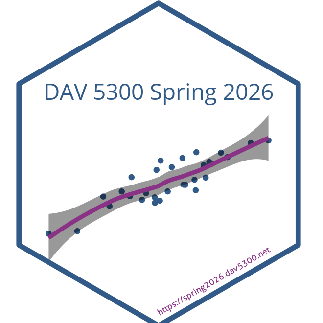

<!-- README.md is generated from README.Rmd. Please edit that file -->

```{r, include = FALSE}
source('config.R')
```

DAV5300 `r semester` `r year`
================

<a href='`r paste0('https://', tolower(semester), year, '.data606.net')`'></a>

Instructors: [Jason Bryer](https://bryer.org)  
Class Meetup: Tuesdays at 10:45am or 1:00pm  
Office Hours: By appointment  
Contact: <jason.bryer@yu.edu>  
Website: <`r paste0('https://', tolower(semester), year, '.dav5300.net')`>

<hr> 

<a rel="license" href="http://creativecommons.org/licenses/by-nc/4.0/"></a><br />This work is licensed under a <a rel="license" href="http://creativecommons.org/licenses/by-nc/4.0/">Creative Commons Attribution-NonCommercial 4.0 International License</a>.
